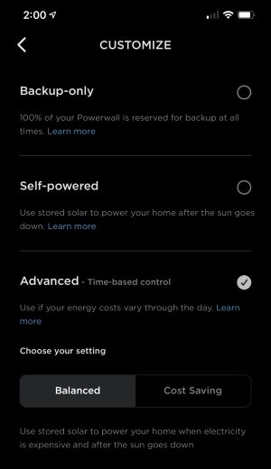
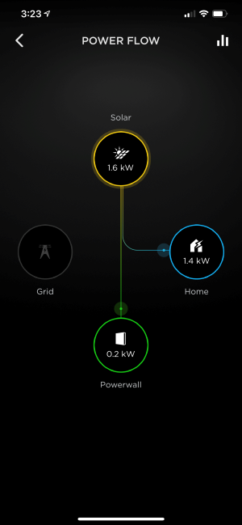

# teslaPowerwall

A project to automate switching modes for Tesla Powerwall Owners

## Welcome! This is my 1st Python project

**_Thanks a friend for helping me with Python in a huge way and to <https://www.teslaapi.io/> for their teardown on the current Tesla API!_**

In an attempt to simplify the lack of functionality in the Tesla app, I wanted a way to switch from Advanced time-based control (autonomous) to Self-powered (self_consumption), and back after the sun sets. For my use case, I do not want to export energy back to the grid and want to charge my Powerwalls as much as possible. This way I can run off of our Powerwalls as long as possible so we don't consume electricity between 3pm - 12am (my peak price times).

## I've created two .py files

`teslatoken.py` - A Python script to automate getting a valid oauth token from Tesla

- Read a .yml file that contains the username and password for the Tesla account
- Obtain an access_token
- Save the token file to a token.yml file for use while it's valid (default is 45 days set by Tesla)
- Check to see if the current token is still valid. If not, get a new token
  
`pw_mode.py` - A Python script to obtain the `energy_site_id` for the Tesla account and command line arguments to switch the energy mode.

- Get the products for the Tesla account
- Gather the `energy_site_id` for the account
- Take command line arguments to switch the mode of the Solar/Powerwalls to/from `self_consumption` or `autonomous`

## Installation

Clone this repository to your host:

```text
git clone https://github.com/natrlhy/teslaPowerwall.git
```

Ensure you have a working installation of Python 3 on your system

## Usage

Modify the `accounts.yml` to include your Tesla Account email address the the respective password.

In the `teslatoken.py` file you may want to modify these lines to fit your environment. It assumes you will be in the directory that you are running the `pw_mode.py` script. Search the `teslatoken.py` file for `yml` and modify the paths as needed.

```text
conf = yaml.safe_load(open("accounts.yml"))
ACCOUNTS = "accounts.yml"
TOKENFILE = "token.yml"
```

Switch the mode to the Self-powered mode:

```text
python3 pw_mode.py self_consumption
```

Switch the mode to Advanced time-based control:

```text
python3 pw_mode.py autonomous
```



After switching to Self-powered. Supplying Solar energy to the home and charging the Powerwalls!



## Suggestions

### Linux/Rasberry Pi

To automate this, I am using a Raspberry Pi3. In cron I have this set:

```text
00 15 * * * cd ~/teslaPowerwall;python3 pw_mode.py self_consumption
00 17 * * * cd ~/teslaPowerwall;python3 pw_mode.py autonomous
```

### Windows

A quick guide on how to import tasks:

<https://www.tenforums.com/tutorials/65264-import-task-task-scheduler-windows.html>

I've included two Windows Task Scheduler xml files you can import into Windows Task Scheduler. You will need to modify the following:

- Change User or Group
- Path to where you will be running the python script
- Times you'd like to run each task to fit your needs

As noted in the Installation section above, make sure you have a working Python 3.8 installation on your Windows machine

## To-Do List

- Implement logging
- Command line switch parameters and help
